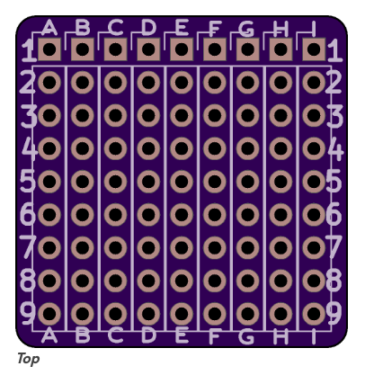

# One Sq Inch Prototype Board

This is 1" x 1" `prototyping solderable board`, for breadboard prototyping.

# Specification for the 1 inch x 1 inch Plated Through Hole (PTH) Board

This board is fabricated as 3x4-boards (i.e. 12 in one piece), and can easily be divided by simply breaking them apart to individual 1" x 1" boards.

| parameter | imperial | metric |
| -----------|-------|------|
| board material | FR4 | FR4 |
| number of PTH | 81 | 81 |
| number of rows | 9 | 9 |
| hole diameter | 39.4 mil | 1.0 mm |
| hole grid | 100 mil (0.1") | 0.254 mm |
| hole plating | gold (ENIG) | gold (ENIG) |
| cupper on both side | yes | yes |
| PTH interconnected | no | no |
| cupper layer thickness | 35 um | 35 um |
| board color | black | black |
| board text | white | white |
| board weight | 0.05 oz | 14 gram |

# Open Source

This project is open source, so in this repository you will find KiCad PCB design files and gerbers for this board.

In the fabrication/GERBERS folder you find the zip-archive which directly can be uploaded to a prototype service such as [OSHPark](https://oshpark.com). However the original board available on `Tindie` has been fabricated to a high quality standard. You may also modify the design with help of the KiCad-files to fit your specific need, and that's ok with us!

If you appreciate our work and use any files, why not buy us a cup of coffee?

We love designing, making and releasing our projects as open source. We do it because we believe it’s important to share knowledge and give back to the community as many have done before us. It helps us all learn and grow. However, all these open source projects are done in our free time, i.e. off work.

That said, time, and effort have gone into designing and releasing these files, so please consider supporting us by buying one of our creations in our `Tindie shop`, and they are really cheap!

Thank you for your support.

# Who are Debinix Team?

We do custom projects around microcontrollers, sensors, and short-distance wireless communication for harsh operation e.g. in the marine environment.
There is always a delicate balance between, cost, quality, and features in what we make. We strive to live after Albert Einstein's famous quote; `“Everything should be made as simple as possible, but not simpler.”`

If you share above philosophy, don’t hesitate to contact us for a discussion on what we can do to realize your ideas!

# License

These files are released under the [creative commons license](LICENSE.md).
